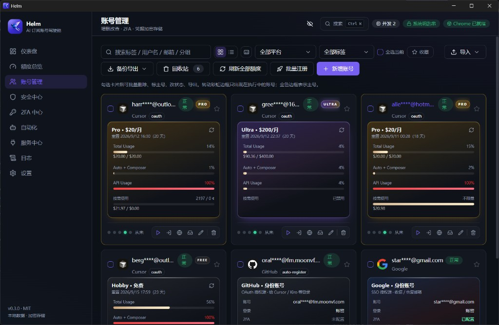
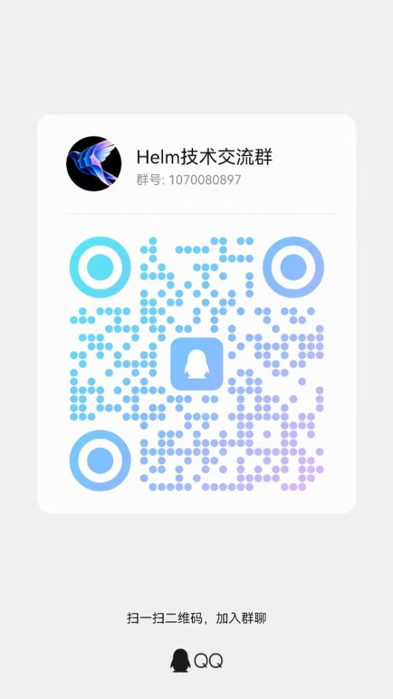
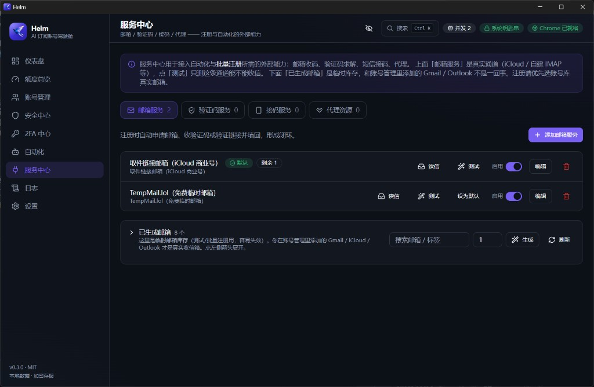
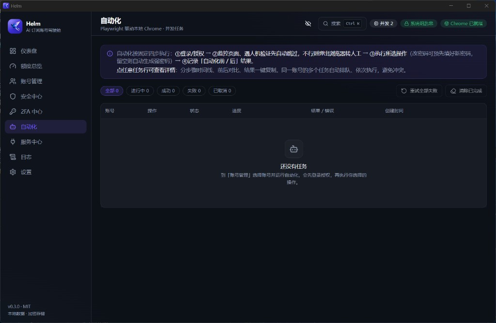

# Helm

[](https://github.com/123marks/Helm/releases/latest)
[](LICENSE)
[](https://github.com/123marks/Helm/releases)

> **AI 订阅账号的驾驶舱。** 一个地方看清 Cursor / ChatGPT / Claude / Kiro / Windsurf / Grok / Antigravity 的会员档位与剩余额度，顺带把 Google / GitHub / X 等身份账号的密码、2FA、恢复信息管起来，并用 **Playwright 驱动本地 Chrome** 完成改密码 / 改恢复信息 / 注册等自动化。
>
> Electron + React + TypeScript + Playwright · 凭据本地加密 · 开源 (MIT)

交流反馈：[Releases](https://github.com/123marks/Helm/releases) · QQ 群 `1070080897`（下方有二维码）

<p align="center">
  
</p>

---

## ✨ 功能特性

- **额度总览（Cockpit）**：全平台订阅额度一屏看完 —— 月订阅成本、平均用量、告警清单、重置倒计时、平台聚合，支持后台按间隔自动刷新。
- **使用趋势**：每次查询都留一条快照，画出 24h / 7d / 30d / 90d 的用量曲线，总体与各平台分线可切换。
- **Outlook 邮箱池**：导入现成微软号 combo（四段 / 六段），管理状态与用量、批量保活刷新 refresh_token、导出，或「取号建账」秒级建进账号库；批量注册可直接用池里的邮箱给 ChatGPT 等平台收码。
- **会员档位识别**：内置各平台官方档位目录（Cursor Hobby/Pro/Pro+/Ultra/Teams、ChatGPT Free/Go/Plus/Pro/Business、Claude Pro/Max 5×/Max 20×/Team、Kiro Free→Power、Windsurf、SuperGrok、Google AI Plus/Pro/Ultra），卡片直接显示档位、价格与它到底买到了什么。
- **授权即出数**：OAuth / Token 导入完成后主进程自动拉一次额度，不用再手动点刷新。
- **多账号集中管理**：Google / GitHub / X / YouTube / OpenAI / Cursor 等，支持分组、标签、搜索、批量选择。
- **凭据加密存储**：密码、2FA 密钥、备用码、Refresh Token 使用 **AES-256-GCM** 加密，主密钥由操作系统钥匙串（`safeStorage`）封存。
- **全局脱敏**：顶栏小眼睛 / `Ctrl+Shift+H` 统一隐藏密码、2FA、手机号；列表内可复制、可编辑。
- **实时 2FA (TOTP)**：账号列表内联验证码与倒计时环；支持手输密钥 / `otpauth://` / 二维码导入。
- **接码与邮箱**：SMS-Activate 兼容协议 / SMSBower / SMSPool；IMAP/SMTP、iCloud IMAP、Hide My Email（icloud-hme）、商业 iCloud Mail API。
- **浏览器自动化**：Playwright 驱动本机 Chrome，独立持久化配置。Google 一条龙（改密 / 改手机 / 启用与轮换 2FA / 备用码）；GitHub 邮箱注册（Create account + Arkose + launch code）。
- **OAuth 注册**：用已登录的 Google / GitHub 账号在 OpenAI / Cursor / Windsurf / Discord 完成授权注册。
- **并发任务队列**：可配置并发，实时进度、可取消、失败自动截图。
- **导入 / 导出**：账号数据一键备份与迁移。

## ⬇️ 下载安装

前往 [**Releases**](https://github.com/123marks/Helm/releases) 下载对应系统的安装包：

| 系统 | 推荐下载 | 其他格式 |
|---|---|---|
| Windows 10/11 (x64) | `...-win-x64-setup.exe` 安装版 | `...-win-x64-portable.exe` 便携版、`...-win-x64.zip` 解压版 |
| Windows on ARM | `...-win-arm64-setup.exe` | — |
| macOS (Apple Silicon) | `...-mac-arm64.dmg` | `...-mac-arm64.zip` |
| macOS (Intel) | `...-mac-x64.dmg` | `...-mac-x64.zip` |
| Linux (x64) | `...-linux-x86_64.AppImage` | `...-linux-amd64.deb`、`...-linux-x64.tar.gz` |

安装版（Windows setup / macOS dmg / Linux AppImage）启动后会检查 GitHub Releases，有新版本会自动下载并提示重启安装。便携版 / zip 需手动到 Releases 换包。

运行前置条件：本机已安装 **Google Chrome**（自动化功能依赖它，应用本身不内置 Chromium）。

安装包未做代码签名：Windows 出现 SmartScreen 时选「更多信息 → 仍要运行」；macOS 首次请右键 → 打开，或执行 `xattr -cr "/Applications/Helm.app"`。开发者购买证书后的配置方法见 [`docs/RELEASE.md`](docs/RELEASE.md#代码签名)。

## 💬 交流群

扫码或搜索群号加入，反馈问题、交流用法。群名 **Helm 技术交流群**，群号 **`1070080897`**。

<p align="center">
  
</p>

## 🧱 技术栈

| 层 | 技术 |
|---|---|
| 桌面框架 | Electron |
| 构建 | electron-vite + Vite |
| 前端 | React 18 + TypeScript + Tailwind CSS + shadcn/ui + zustand |
| 数据库 | sql.js（SQLite / WebAssembly，无需原生编译） |
| 加密 | Node crypto (AES-256-GCM) + Electron safeStorage |
| 2FA | otpauth · jsqr（二维码） |
| 自动化 | playwright-core（驱动本地 Chrome） |

## 🚀 快速开始

前置：Node.js ≥ 20、本机安装 **Google Chrome**。

```bash
npm install
cp .env.example .env   # 可选：填 Antigravity 的 OAuth 凭据
npm run dev            # 开发模式（Vite HMR + Electron）
```

> `.env` 只影响 Antigravity 的「OAuth 授权」入口。留空不影响其他平台，Antigravity 仍可在「Token / JSON」页粘 `refresh_token` 或 `oauth_creds.json` 添加。

其他命令：

```bash
npm run typecheck  # 类型检查（主进程 + 渲染层）
npm run build      # 生产构建到 out/
npm run dist:win   # 打 Windows 安装包 / 便携版 / zip（产物在 release/）
npm run dist:mac   # 打 macOS dmg / zip（需在 macOS 上执行）
npm run dist:linux # 打 Linux AppImage / deb / tar.gz
```

> 国内网络首次打包建议设置 Electron 镜像，详见 [`docs/RELEASE.md`](docs/RELEASE.md)。

> 数据库使用 sql.js（WASM），**无需任何 C++/原生编译**，`npm install` 开箱即用。

## 📸 界面

<p align="center">
  
</p>
<p align="center"><b>服务中心</b> · 邮箱 / 验证码 / 接码 / 代理</p>

<p align="center">
  
</p>
<p align="center"><b>自动化</b> · Playwright 驱动本地 Chrome · 并发任务</p>

首次运行会在系统 userData 目录初始化本地数据库与加密主密钥。其他页面：仪表盘、额度总览、安全中心、2FA 中心、日志、设置。

> 从旧版 AI-AccountManager 升级：首次启动会自动把旧数据目录（`%APPDATA%/AI Account Manager` 或 `ai-account-manager`）里的数据库、主密钥与浏览器配置迁移到 Helm 目录，旧目录保留为备份。

## 📂 项目结构与文档

- 架构设计与实现规范：[`docs/ARCHITECTURE.md`](docs/ARCHITECTURE.md)
- 开发者 / 交接文档：[`docs/HANDOFF.md`](docs/HANDOFF.md)
- 安全模型与责任使用：[`docs/SECURITY.md`](docs/SECURITY.md)
- 打包与发布指南：[`docs/RELEASE.md`](docs/RELEASE.md)
- 品牌与图标提示词：[`docs/BRAND.md`](docs/BRAND.md)
- 已落地的开发规格（0.2.0）：[`docs/dev/README.md`](docs/dev/README.md)

```
src/
  shared/     主/渲染共享类型与 IPC 通道
  main/       Electron 主进程：db / crypto / totp / logger / automation / ipc
  preload/    contextBridge 暴露 window.api
  renderer/   React 前端：components(ui) / pages / store / lib
```

## 🔐 安全与合规

- 所有数据仅保存在**本机**，不上传任何服务器。
- 敏感字段加密存储；明文主密钥仅驻留主进程内存，渲染层无法获取。
- 导出文件包含明文凭据，仅用于本地备份，请妥善保管。

**责任使用**：本工具仅用于管理**你本人拥有或已获授权**的账号，须遵守各平台服务条款与所在地法律法规，不得用于任何未授权访问或滥用。详见 [`docs/SECURITY.md`](docs/SECURITY.md)。

## ⚠️ 关于自动化的说明

Google / GitHub / X 等平台存在验证码、设备验证与风控机制。本工具以“驱动本地真实登录态的 Chrome”为主，尽量降低被拦概率，但**不保证 100% 成功**，也不包含任何绕过验证码/风控的手段。若遇到挑战，请关闭无头模式，在弹出的浏览器中手动完成一次登录后重试。平台改版可能导致个别自动化流程失效，欢迎社区共同维护（见 `docs/HANDOFF.md` 的扩展指南）。

## 🗺️ 路线图

- 更多平台的操作 flows（GitHub / X / YouTube 扩展）
- 国际化（i18n）
- flow 冒烟测试与选择器健康检查

## 📄 许可证

[MIT](LICENSE)
